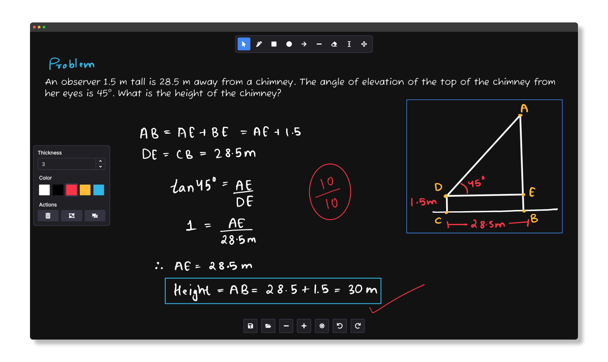

> [!NOTE]
> Drawy has moved to KDE Invent. This repository is kept only to track and resolve existing issues. Please open all new issues and pull requests on KDE Invent instead.
>   
> https://invent.kde.org/prayag/drawy
>
> Please be aware that Drawy does **NOT** currently offer official packages in any public repository. However, official nightly packages are available on [KDE Invent](https://invent.kde.org/graphics/drawy/-/jobs?kind=BUILD)  

  

  
  <h1 align="center">Drawy</h1>
  
Your handy, infinite brainstorming tool!

Drawy is a work-in-progress infinite whiteboard tool written in Qt/C++, which aims to be a native-desktop alternative to the amazing web-based Excalidraw.  

# Installation  

## Compiling from Source
- Install `cmake` and `g++`
- Install Qt 6.9 or above from [here](https://www.qt.io/download-qt-installer-oss) or using [aqtinstall](https://github.com/miurahr/aqtinstall)
- Clone this repository: `git clone https://github.com/prayag2/drawy && cd drawy`
- Setup cmake: `cmake -B build -S . -DCMAKE_BUILD_TYPE=Release`
- Compile: `cmake --build build --config Release`
- Run: `./build/drawy`

# Keyboard Shortcuts
Future releases will allow you to change the keyboard shortcuts. For now they are hardcoded. Here's a list of all available keyboard shortcuts:
| Key Combination                                                             | Description       |
|:---------------------------------------------------------------------------:|:-----------------:|
| <kbd>Ctrl</kbd> + <kbd>Z</kbd>                                              | Undo              |
| <kbd>Ctrl</kbd> + <kbd>Y</kbd>, <kbd>Ctrl</kbd> + <kbd>Shift</kbd> + <kbd>Z</kbd> | Redo              |
| <kbd>Ctrl</kbd> + <kbd>+</kbd>                                                | Zoom In           |
| <kbd>Ctrl</kbd> + <kbd>-</kbd>                                                | Zoom Out          |
| <kbd>Ctrl</kbd> + <kbd>G</kbd>                                                | Group selection   |
| <kbd>Ctrl</kbd> + <kbd>Shift</kbd> + <kbd>G</kbd>                               | Ungroup selection |
| <kbd>P</kbd>, <kbd>B</kbd>                                                  | Freeform Tool     |
| <kbd>E</kbd>                                                                | Eraser Tool       |
| <kbd>S</kbd>                                                                | Selection Tool    |
| <kbd>R</kbd>                                                                | Rectangle Tool    |
| <kbd>O</kbd>                                                                | Ellipse Tool      |
| <kbd>L</kbd>                                                                | Line Tool         |
| <kbd>A</kbd>                                                                | Arrow Tool        |
| <kbd>M</kbd>                                                                | Move Tool         |
| <kbd>T</kbd>                                                                | Text Tool         |
| <kbd>Ctrl+A</kbd>                                                           | Select All        |
| <kbd>Delete</kbd>                                                           | Delete selection  |
| <kbd>Ctrl+S</kbd>                                                           | Save              |
| <kbd>Ctrl+O</kbd>                                                           | Open File         |

# Contributing
Please open merge requests on KDE Invent: https://invent.kde.org/graphics/drawy

# License
This project uses the GNU General Public License V3.
